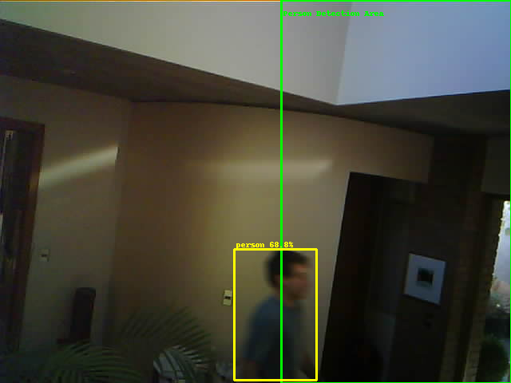

# Contador de personas 
Automatizaciones que permiten contar personas que entran o salen de un lugar usando una cámara IP (ESP32-CAM) y la plataforma de detección de objetos DOODS.

# Explicación y archivos
La implementación del contador es algo rudimentaria. Los pasos a seguir son:

   1) se definieron áreas que representan el lado izquierdo y derecho de la imagen proveniente de la cámara, y se corre detección de personas en cada una de estas áreas en paralelo. Todo esto se puede encontrar en el archivo `image_processings.yaml`. Se dejó un espacio entre las áreas para que no haya traslape y no ocurra que se detecte a una persona dos veces, u otros casos indeseables.
   2) se crean automatizaciones que permiten detectar cuándo una persona pasa desde el área izquierda hacia la derecha y viceversa. Se pueden encontrar en el archivo `automations.yaml`. Dependiendo de la dirección se suma o se resta al contador definido en `counters.yaml`. 
   3) para que todo esto funcione, se deben incluir estos archivos en la configuración principal (`configuration.yaml`) como sigue:
            
            counter: !include counters.yaml
            automation: !include automations.yaml 
            image_processing: !include image_processings.yaml

# Comentarios
Los parámetros que influyen en la rutina de conteo son: 

- el intervalo de escaneo `scan_interval` del procesamiento de imágenes. Por ahora se setea en 0.5 debido a que se necesita una frecuencia alta para detectar gente caminando, debido a que se probó en un espacio reducido. Esto hace muy ineficiente la detección. Se considerará hacer una primera etapa de detección de movimiento para así ahorrar CPU.
- las áreas que definen la parte izquierda y derecha de la imagen. Estas dependerán de la cámara y de las regiones físicas que se quieren escanear. 
- el umbral de seguridad aceptado para considerar a alguien una persona (60% por ahora). 
- el tiempo máximo `timeout` que se debe esperar para gatillar un aumento o disminución del contador, por ahora igual a 1 segundo. Esto denuevo dependerá del entorno en donde esté la cámara.
- dependiendo de la dirección que se considere *"hacia adentro"* o *"hacia afuera"*, se fijará si se aumenta o disminuye el contador.

# Ejemplo 
Podemos ver las imágenes que genera el programa cuando se detecta una persona, junto con las áreas de detección y el Bounding Box que contiene a la persona detectada. En este caso, se detecta cómo alguien se mueve desde el lado izquierdo al derecho de la imagen, y se aumenta el contador en una unidad.

<table>
  <tr>
     <td>Detección lado izquierdo</td>
     <td>Detección lado derecho</td>
  </tr>
  <tr>
    <td></td>
    <td></td>
  </tr>
</table>
